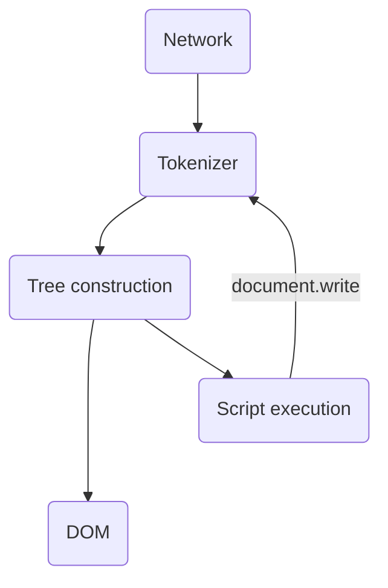

Website loading speed is an important ranking factor in search results and a factor in user perception. It is believed that the loading time of a site directly affects its conversion.

It is logical, if the user gets mad before he can see the list of products in the online store, who will feel better from this?

There is an opinion that the reaction speed of the average person varies in the range of 200-250 milliseconds. There is even a rather amusing [reaction rate test](<(https://humanbenchmark.com/tests/reactiontime)>) that confirms this.

Thus, we can assume that everything that fits into 250 milliseconds is perceived by a person as “instantly”. A few hundred milliseconds is “fast enough”. This is approximately the value that you should strive for if we are talking about page loading speed.

Web page loading can be roughly divided into three major parts:

1. Network
2. Server
3. Client

This essay will mainly deal with the first part, but the other two will be partly affected.

But before you start working on optimizing our incredible online portal, It's worth getting to grips with some basic things.

## How does the browser work?

It all starts with young Anonymous typing a URL into the address bar of his favorite Google Chrome. For example, for some reason he decided to read this publication and opened the address: `https://azat.io/en/fluid-interfaces`.

Next, the browser pulls this address into pieces:

- `https` - protocol
- `azat.io` - host
- `/ru/fluid-interfaces` - resource

Based on the host, the browser needs to resolve the IP address of our server, where, in fact, this blog is serving. For this, DNS is used.

DNS servers are commonly compared to yellow phone books with phone numbers where the contact name corresponds to the site host and the number corresponds to their IP address on the network.

Here it is necessary to make a note that if a request to the host has already been made before, then there will be no request to the DNS, and the server IP address will be taken from the local cache.

Also, before all this business, the browser will certainly want to visit the `hosts` file, which contains the database of domain names and used when they are translated into network addresses of nodes (in macOS, for example, this file is located in `/private/etc/hosts`). But these are not details that interest us very much.

Further, knowing the IP address, it is already possible to establish a connection using the TCP data transfer protocol. For a TCP connection, the port on which the connection is established matters: for the http protocol - 80, for https - 443.

When establishing a connection using the https protocol, TLS Handshake is also performed.

The client sends a message to the server that contains the version of the TLS protocol (a cryptographic protocol that provides secure data transfer), as well as a list of supported encryption algorithms and data compression methods. The server, in turn, responds to it in the same way, and also sends an SSL certificate to our service containing a public key. The client generates a random string in response and encrypts it using the server's public key. The server decrypts it using its secret key and uses this string to create a master key, on the basis of which both the client and the server will generate a symmetric key. After that, the data received via HTTP will be transmitted in a form encrypted using a symmetric key.

And now, after the connection is established, we form the HTTP header.

An HTTP header is a simple text header, where at the very beginning there is a line indicating the method (`GET`, `POST`, `PUT`, etc.), then the resource location and the HTTP protocol version. At the same time, the Host header is indicated, which, as usual, matches the domain name. And in addition, the `Connection: close` header arrives, because some browsers can make persistent connections.

```
GET / HTTP/1.1
Host: azat.io
Connection: close
[...]
```

The response of the HTTP request is information that an error has occurred with an indication of its code, or the response will be a header where status-code 200 will be indicated and our long-awaited HTML page will be transmitted.

The time from the start of the entire process until the first HTML data packet is received is called Time to First Byte (TTFB). As a rule, the first data packet contains 14 kB, but more on this fun below.

Here the browser begins the process of parsing the resulting HTML page. When parsing HTML, the DOM and CSSOM are formed. And a rendering tree is created with a set of elements, on the basis of which the render is made.

If there are scripts on the page, then they can change the position of the elements, their size. This all leads to the fact that the reflow and redraw process will start.

Parsing is a fairly large task, where there is at least one reflow and one redraw.



Here we will not dig deep into how exactly the page is rendered, everything is in general terms. Ultimately, this is where our beautiful page will be displayed in the browser.

## How networking works

The bandwidth has a great influence on the speed of loading a web page at the network level.

Bandwidth is the maximum amount of data that can be transmitted over an Internet connection in a given amount of time. It is usually measured in megabits per second (Mbps).

The bandwidth can be compared to a water pipe: the wider it is, the more water can pass through it per unit of time.

Bandwidth is typically much lower on mobile devices, especially on 3G networks. Therefore, here the influence of the network on speed is much higher than on the desktop.

The time it takes for a request to travel from the client to the server and back is called round trip time (RTT).

The round-trip time can be determined using the `ping` command. The average time for an ideal round trip is 50 milliseconds.

```
PING azat.io (75.2.60.5): 56 data bytes
64 bytes from 75.2.60.5: icmp_seq=0 ttl=117 time=31.788 ms
64 bytes from 75.2.60.5: icmp_seq=1 ttl=117 time=32.157 ms
64 bytes from 75.2.60.5: icmp_seq=2 ttl=117 time=31.282 ms
64 bytes from 75.2.60.5: icmp_seq=3 ttl=117 time=31.204 ms

--- azat.io ping statistics ---
4 packets transmitted, 4 packets received, 0.0% packet loss
round-trip min/avg/max/stddev = 31.204/31.608/32.157/0.388 ms
```

At the same time, in addition to HTML, our page, in turn, also consists of CSS, JS files, pictures, etc. Each resource needs a network trip.

RTT is directly affected by latency. The main factor affecting the delay is the distance to the destination server and the route to it, since the data is not transmitted over a single network, but passes through several autonomous systems. The quality of the network is also important: 3G networks, for example, can easily have a delay of 100 to 500 milliseconds, which wildly affects the speed of the user receiving content. Other causes include servers handling high volumes of traffic, busy networks such as in crowded areas, and inefficient routers.

And if bandwidth improves with the development of technology, then the delay is at least limited by the speed of light.

Fun fact: the minimum distance from Mars to Earth is 36.64 million miles, and the maximum distance is 250 million miles. Since communication is limited by the speed of light, a message sent from Mars will take at least 3 minutes. 22 sec. up to 44 min.

For this reason, by the way, somewhere in Australia and New Zealand, the download speed of Internet resources is usually lower, since most of the servers are located in the USA and Europe.

Another problem is packet loss, which is usually handled at the network layer, but it does occur in unstable networks, which can cause the RTT time to increase significantly.

## We love the numbers

Performance can be measured using Lighthouse in the Chrome DevTools. Or with the help of a [similar cloud service](https://web.dev/measure), which is more worth focusing on if the goal is to stick to SEO, but it is preferable, of course, to look at the first option.

What can be seen there:

First Contentful Paint - Displays the time it takes the browser to render the first piece of DOM content. Fast is FCP, which does not exceed 1.8 seconds.

Speed ​​Index - the speed of visual display of content during page load. During its evaluation, the browser compares the loading speed of our page with other real sites from the HTTP archive.

Largest Contentful Paint - Displays the load time of the largest item in the user's viewport.

Time to Interactive - Displays the time from when the page starts loading until the page becomes fully interactive.

Total Blocking Time - for how long the page is blocked when no actions are available to the user: clicks or pressing on the keyboard keys.

Cumulative Layout Shift - layout shift due to asynchronous loading of resources.

## What can be done about it?

There is a TCP slow start specification, an algorithm according to which the size of the first data packet is always 14 kB.

The problem is that the server has no idea how much data the Internet connection can handle, which is why it first sends a small, reliable amount of data (10 TCP packets with a maximum size of 1500 bytes).

For this reason, a 14kb web page loads significantly faster than a 15kb web page, although the difference between the two seems to be minimal. In this manner, the weight of our HTML should not exceed 14 kB, otherwise it is fraught with the fact that one more RTT will be committed.

To reduce the amount of data transferred, various data compression algorithms should be used, such as Brotli and Gzip.

****

It is important not to forget that the further Anonymous is from the server, the longer his request takes to complete. This problem is due to the fact that when using TCP/IP, the delays depend on the number of routes between the client and the server. This problem is solved by content delivery networks (CDN). These are geographically distributed servers that serve static data. It follows that hosting content on multiple servers shortens the network route for data transmission.

To reduce the impact of latency, you should also try to avoid chaining calls as much as possible. For example, when you load fonts from CSS files.

A good option here would be to use `preload`:

```html
<link
  rel="preload"
  href="/fonts/awesome-font.woff2"
  type="font/woff2"
  as="font"
  crossorigin
/>
```

When loading a third-party web font, you also need to make sure that the text remains visible. This can be done by enabling `font-display: swap`:

```css
@font-face {
  font-family: 'Awesome Font';
  font-style: normal;
  font-weight: 400;
  src: url('/fonts/awesome-font.woff2') format('woff2');
  font-display: swap;
}
```

You should get rid of redirects to display the first page. For example, you should not redirect to the mobile version of the site, instead it is better to do an adaptive layout, while using the “Mobile first” methodology, since mobile devices are often weaker than desktops.

In order to speed up the first contentful paint, there is also such a trick as inline styles, so as not to make an extra request. Because inline styles will be loaded from the first request, and even the aforementioned `preload` only from the second.

If the styles do not change or change rarely and are associated with an external file, then you can, of course, hope that they will be loaded from the cache. But there is a problem that the cache on mobile devices is not very large and is quickly crowded out.

When working with scripts, you should always use the `defer`/`async` attributes so that there are no blocks when rendering content.

It is extremely important to implement well-thought-out code-splitting.

Lazy loading images is also a must for pages that contain a large number of them. A similar thing to reduce content rendering time could be the `content-visibility` CSS property.

Using the HTTP/2 protocol is another way to speed up page loading. First of all, acceleration is achieved due to the fact that several requests using the second version of the protocol can be sent through one TCP connection, regardless of the type of resource, and also due to the fact that HTTP headers are compressed.

So, by working like Papa Carlo, you can significantly reduce network costs and make the end consumer a little happier, and the owner of the business a little richer.
