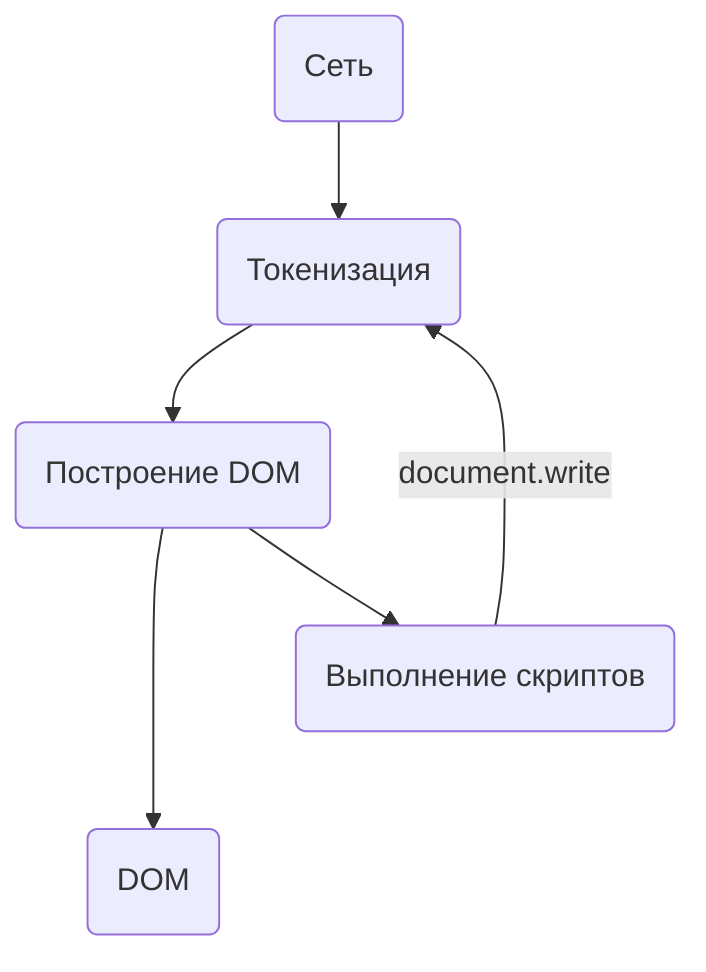

Скорость загрузки сайта – важный фактор ранжирования в поисковой выдаче и фактор восприятия его пользователем. Считается, что время загрузки сайта напрямую влияет на его конверсию.

Оно и логично, если пользователь осатанеет до того, как сможет узреть список товаров в онлайн-магазине, кому от этого станет легче?

Бытует мнение, что скорость реакции среднестатистического человека варьируется в диапазоне 200-250 миллисекунд. Есть даже довольно занятный [тест на скорость реакции](https://humanbenchmark.com/tests/reactiontime), это подтверждающий.

Таким образом, можно считать, что всё, что укладывается в 250 миллисекунд человеком воспринимается как “мгновенно”. Несколько сотен миллисекунд – “достаточно быстро”. Это примерно то значение, к которому и стоит стремиться, если мы говорим о скорости загрузки странички.

Загрузку веб страницы можно условно разделить на три большие части:

1. Сеть
2. Сервер
3. Клиент

В этом очерке преимущественно будет рассматриваться первая часть, но и другие две будут отчасти затронуты.

Но прежде чем начать работать над оптимизацией нашего модного интернет-портала, стоит разобраться с кое-какими базовыми штуковинами.

## Как работает браузер?

Всё начинается с того, что юный анон вбивает URL в адресную строку своего любимого Гугл Хрома. Например, ему отчего-то вздумалось почитать эту публикацию и он перешёл по адресу: `https://azat.io/ru/fluid-interfaces`.

Далее браузер дербанит этот адрес на части:

- `https` - протокол
- `azat.io` - хост
- `/ru/fluid-interfaces` - ресурс

На основе хоста браузеру надо разрезолвить IP-адрес нашего сервака, где, собственно, и крутится этот бложик. Для этого используется DNS.

DNS-сервера, как правило, уподобляют жёлтым телефонным книжкам с номерами телефонов, где имени контакта соответствует хост сайта, а номеру – его IP-адрес в сети.

Здесь полагается сделать примечание, что ежели ранее запрос к хосту уже осуществлялся, то запроса к DNS не будет, а IP-адрес сервера будет взят из локального кэша.

Также, перед всем этим делом, браузер непременно возжелает посетить файл `hosts`, содержащий базу доменных имён и используемых при их трансляции в сетевые адреса узлов (в macOS этот файлик, например, находится в `/private/etc/hosts`). Но это уже не шибко интересующие нас детали.

Далее, зная IP-адрес, посредством протокола передачи данных TCP уже можно установить соединение. Для TCP соединения имеет значение порт по которому устанавливается соединение: для протокола http – 80, для https – 443.

При установке соединения по протоколу https также осуществляется TLS Handshake (т. н. братское рукопожатие).

Клиент отправляет серверу месседж, который содержит версию протокола TLS (криптографический протокол, обеспечивающий защищённую передачу данных), а также список поддерживаемых алгоритмов шифрования и методов компрессии данных. Сервер в свой черёд отвечает ему тем же, а также посылает SSL сертификат нашего сервиса, содержащий публичный ключ. Клиент в ответ генерирует случайную строку и шифрует с помощью публичного ключа сервера. Сервер её расшифровывает с помощью своего секретного ключа и использует эту строку для создания уже мастер-ключа, на основе которого и клиент и сервер сгенерят симметричный ключ. После чего данные, полученные посредством HTTP будут передаваться в зашифрованном с помощью симметричного ключа виде.

И вот, после того, как соединение установлено мы формируем HTTP-заголовок.

HTTP-заголовок - это простой текстовый заголовок, где в самом начале идёт строчка с указанием метода (`GET`, `POST`, `PUT` и т.д.), далее локейшен ресурса и версия HTTP протокола. Вместе с тем указывается заголовок Host, который, как водится, совпадает с доменным именем. И в довесок ещё прилетает заголовок `Connection: close`, потому что некоторые браузеры умеют делать персистентные соединения.

```
GET / HTTP/1.1
Host: azat.io
Connection: close
[...]
```

Ответом HTTP-запроса является информация о том, что произошла ошибка с указанием её кода, либо же ответом будет заголовок, где будет указан status-code 200 и будет передана наша долгожданная HTML-страница.

Время от начала всего процесса до момента получения первого пакета данных HTML называется Time to First Byte (TTFB). Как правило, первый пакет данных содержит 14 кБ, но об этой забаве чуть ниже.

Здесь браузер начинает процесс парсинга полученной HTML-страницы. При парсинге HTML формируется DOM и CSSOM. И создаётся дерево рендеринга с набором элементов, на основе которого делается отображение.

Если на странице есть скрипты, то они могут изменять положение элементов, их размер. Это всё приводит к тому, что запустится процесс reflow и redraw.

Парсинг – задача достаточно объёмная, где есть как минимум один reflow и один redraw.



Здесь не будем шибко глубоко зарываться в то, как именно происходит рендеринг страницы, всё в общих чертах. В конечном итоге здесь произойдёт отображение нашей распрекрасной страницы в браузере.

## Как устроено сетевое взаимодействие

Большое влияние на скорость загрузки веб-страницы на сетевом уровне оказывает ширина канала.

Ширина канала – это максимальный объём данных, который можно передать через интернет-соединение за заданный промежуток времени. Исчисляется, как правило, в мегабитах в секунду (Мбит/с).

Ширину канала можно сравнить с водопроводной трубой: чем она шире, тем больше воды сможет по ней пройти за единицу времени.

На мобильных устройствах ширина канала, по своему обыкновению, значительно ниже, особенно в сетях 3G. Посему здесь влияние сети на скорость значительно выше, чем на десктопе.

Время, которое нужно, чтоб запрос дошёл от клиента до сервера и обратно называется время приёма-передачи или Round trip time (RTT).

Время приёма-передачи можно определить с помощью команды `ping`. Среднее время идеального раунд трипа - 50 миллисекунд.

```
PING azat.io (75.2.60.5): 56 data bytes
64 bytes from 75.2.60.5: icmp_seq=0 ttl=117 time=31.788 ms
64 bytes from 75.2.60.5: icmp_seq=1 ttl=117 time=32.157 ms
64 bytes from 75.2.60.5: icmp_seq=2 ttl=117 time=31.282 ms
64 bytes from 75.2.60.5: icmp_seq=3 ttl=117 time=31.204 ms

--- azat.io ping statistics ---
4 packets transmitted, 4 packets received, 0.0% packet loss
round-trip min/avg/max/stddev = 31.204/31.608/32.157/0.388 ms
```

При этом наша страница кроме HTML состоит в свою очередь также из CSS, JS файлов, картинок и т. п. На каждый ресурс нужен поход по сети.

На RTT напрямую влияет задержка (latency). Основным фактором, влияющим на задержку является расстояние до конечного сервера и маршрут к нему, поскольку данные передаются не через одну сеть, а проходят через несколько автономных систем. Также важным является качество сети: сети 3G, например, могут запросто иметь задержку от 100 до 500 миллисекунд, что дико влияет на скорость получения пользователем контента. Другими причинами могут быть сервера, справляющиеся с большими объёмами трафика, загруженные сети, например, в местах большого скопления людей и эффективность работы маршрутизаторов.

И если ширина канала улучшается с развитием технологий, то задержка как минимум ограничена скоростью света.

Забавный факт: минимальное расстояние от Марса до Земли – 55.75 млн. км., а максимальное – 401 млн. км. Поскольку обмен данными ограничен скоростью света, отправленное с Марса сообщение будет идти по крайней мере от 3 мин. 22 сек. до 44 мин.

По этой причине, кстати сказать, где-нибудь в Австралии и Новой Зеландии скорость загрузки интернет-ресурсов, как правило, ниже, поскольку большая часть серверов размещается в США и Европе.

Другой бедой может быть потеря пакетов, которая обычно нейтрализуется на сетевом уровне, но в нестабильных сетях оно имеет место быть, из-за чего время RTT может существенно вырасти.

## Любуемся на цифры

Перфоманс можно измерить с помощью Lighthouse в инструментах разработчика Chrome DevTools. Либо же с помощью [аналогичного облачного сервиса](https://web.dev/measure), на который больше стоит ориентироваться, если стоит цель упороться по SEO, но предпочтительнее, конечно, смотреть на первый вариант.

Что там можно увидеть:

First Contentful Paint – отображает время, которое требуется браузеру для отображения первой части содержимого DOM. Быстрым считается FCP, который не превышает 1.8 секунды.

Speed Index – скорость визуального отображения контента во время загрузки страницы. Во время его оценки браузер сравнивает скорость загрузки нашей страницы с другими реальными сайтами из HTTP-архива.

Largest Contentful Paint – отображает время загрузки самого большого элемента в области просмотра пользователя.

Time to Interactive – отображает время с момента начала загрузки до момента, когда страница станет полностью интерактивной.

Total Blocking Time – в течение какого времени происходит блокировка странички, когда пользователю недоступны никакие действия: клики или же клацанья по клавишам клавиатуры.

Cumulative Layout Shift – смещение макета из-за асинхронной загрузки ресурсов.

## Что можно с этим сделать?

Существует спецификация медленного старта TCP, алгоритма, в соответствии с которым, объём первого пакета данных всегда составляет 14 кБ.

Проблема заключается в том, что сервер понятия не имеет, с каким объёмом данных может справиться интернет-соединение, именно поэтому сначала он отправляет небольшое надёжное количество данных (10 TCP пакетов с максимальным размером 1500 байтов).

По этой причине веб-страница размером в 14 кБ грузится существенно быстрее, чем веб-страница размером 15 кБ, хотя разница между ними, казалось бы, минимальна. Таким манером вес нашего HTML не должен превышать 14 кБ, иначе это чревато тем, что будет совершён ещё один RTT.

Для уменьшения объёмов передаваемых данных следует использовать различные алгоритмы сжатия данных, такие как Brotli и Gzip.

****

Важно не забывать, что чем дальше анон находится от сервера, тем дольше идёт его запрос. Проблема эта вытекает из того, что при использовании TCP/IP задержки зависят от количества маршрутов между клиентом и сервером. Эту проблему решают сервисы доставки содержимого (CDN). Это географически распределённые сервера, которые обслуживают статику. Отсюда следует, что размещение контента на нескольких серваках сокращает сетевой маршрут передачи данных.

Для того, чтобы уменьшить влияние задержки, также следует стараться максимально избегать цепочек последовательных вызовов. Например, когда вы подгружаете шрифты из CSS файлов.

Неплохим вариантом здесь было бы использование `preload`:

```html
<link
  rel="preload"
  href="/fonts/awesome-font.woff2"
  type="font/woff2"
  as="font"
  crossorigin
/>
```

Во время загрузки стороннего веб-шрифта надобно ещё убедиться в том, что текст остаётся видимым. Это можно сделать, включив `font-display: swap`:

```css
@font-face {
  font-family: 'Awesome Font';
  font-style: normal;
  font-weight: 400;
  src: url('/fonts/awesome-font.woff2') format('woff2');
  font-display: swap;
}
```

Избавляемся от редиректов для показа первой страницы. Например, не лучшее намерение делать редирект на мобильную версию сайта, вместо этого лучше верстать адаптивно, применяя при этом методологию “Mobile first”, поскольку мобильные устройства зачастую слабее десктопов.

Для того, чтобы ускорить первый показ, существует также такая техника, как инлайн стилей, чтобы не делать лишний запрос. Поскольку инлайн-стили будут загружены с первого запроса, а даже вышеупомянутый `preload` только со второго.

Если стили не меняются или меняются редко и подключаются внешним файликом, можно, конечно, понадеяться на то, что они будут загружены из кэша. Но здесь имеется проблема, что кэш на мобильных устройствах не шибко большой и довольно быстро вытесняется.

При работе со скриптами стоит всегда использовать атрибуты `defer`/`async`, дабы не было блокировок при отрисовке содержимого.

Крайне важным является внедрение грамотно продуманного код-сплиттинга.

Ленивая загрузка изображений тоже мастхев, для страниц, где содержится их большое количество. Схожей штукой для уменьшения времени рендеринга контента может стать CSS-свойство `content-visibility`.

Использование протокола HTTP/2 – ещё один способ ускорить загрузку страницы. Прежде всего ускорение достигается за счёт того, что несколько запросов при использовании второй версии протокола могут быть отправлены через одно TCP-соединение, причём независимо от типа ресурса, а также из-за того, что происходит сжатие HTTP-заголовков.

Вот так, путём вкалывания как Папа Карло, можно существенно сократить издержки сети и сделать конечного потребителя немного счастливее, а хозяина бизнеса немного богаче.
